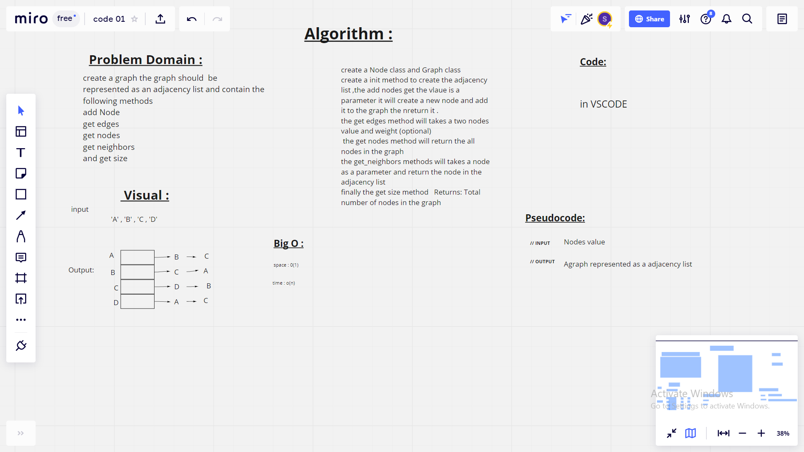

# Data Structures - Graph
# Ode challenge: 35


### Overview
- We created a Graph class represented as an adjacency list
- see the summary for graphs 

```
Graphs
-- collection of vertices and edges
-- Many classifications
---- directed, undirected, cyclic, acyclic, connected, disconnected, complete
-- vertices are considered to have neighbors and degrees
---- degrees: number of edges connected to a vertex
---- neighbor: an adjacent/connected vertex

Directed vs undirected
-- Directed graphs are like trees
---- each vertex (node) points one direction (to the next node)
-- Undirected graphs have bi-directional edges
---- each edge points to both nodes

Complete, Connected, Disconnected
-- Complete graphs have each vertex pointing to every other vertex
-- connected graphs: every vertex has an edge
-- disconnected graphs: some vertexes do not have edges

Acyclic vs cyclic
-- Cyclic is synonymous with circle
---- In a cyclic graph the edges and directions make it circular
---- possible to end up at the same node that you started with
-- Acyclic is not circular
---- these do not have a cycle (way to get back to the start)

Graph representation
-- Adjacency matrix and adjacency list
-- adjacency matrix: two dimensional array of 1's and 0's
---- 1 signifies a connected node (edge)
---- 0 signifies no edge
-- Adjacency list: collection of linked lists
---- point to edges
```

### Approach & Efficiency
- An adjacency list was the chosen data structure to use for the Graph and a list was the chosen data structure for to use at each index of the adjacency list to handle collisions.

- Adding key/value pairs and getting values from the adjacency list is essentially O(1) for time for both posting and getting. 
- The worst case would be the length of the linked list at any given index. 

### API
Our Graph has seven public methods:

- add_node(value): adds a new node to the graph, returns the added node
- add_edge(start_node, end_node, weight): adds new edge between two nodes, takes in two nodes, has ability to add weight
- get_nodes( ) - returns all of the nodes as a collection
- get_neighbors(node): returns a collection of nodes (with weights) connected to a node, takes in a node
- size( ) - returns number of nodes in Graph; integer

### White-Board
