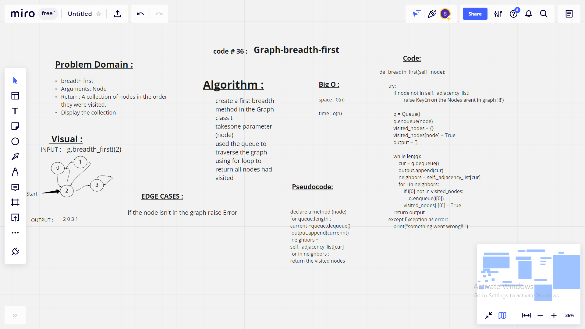

# Breadth-First Traversal of a Graph
## challenge
- Extend your graph object with a breadth-first traversal method that accepts a starting node. then return a collection of nodes in the order they were visited. Display the collection.

## Big O (efficiency)
* O(N^2) for time
* For space efficency it is O(N)

## API
* breadth_first(node): traverses the graph starting from the given node, returns a list of nodes visited during traversal

## white board 
* 