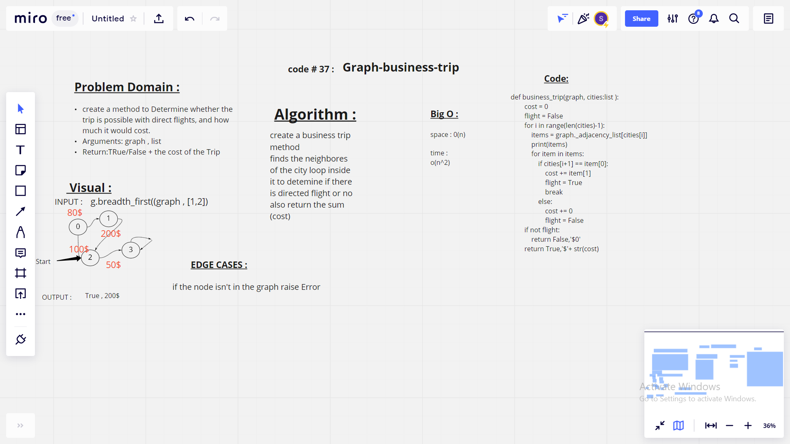

# graph-business-trip
## challenge 37
Given a business trip itinerary, and an Alaska Airlines route map, is the trip possible with direct flights? If so, how much will the total trip cost be?

## Big O (efficiency)
* O(N^2) for time
* For space efficency it is O(N)

## white board 
* 

# graph-depth-first
## challenge 38
Conduct a depth first preorder traversal on a graph

## Big O (efficiency)
* O(N^2) for time
* For space efficency it is O(N)

## white board 
* 