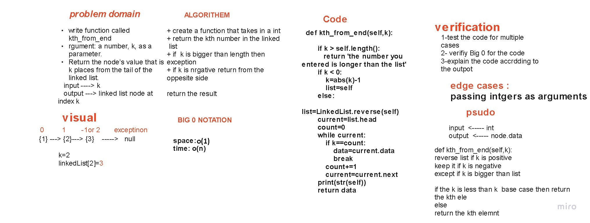

# Linked-List

Using object oriented design constructs, define a Node class and LinkedList class for a singly linked list. Each node has integer data value and a link to the next node. The linked list class has a head node and the following methods defined.

## lab 7
### Challenge Summary
kth from end k-th value from the end of a linked list.

### Approach & Efficiency

#### Solution
[x]argument: a number, k, as a parameter. [x]Return the node’s value that is k places from the tail of the linked list. [x]write unit tests

[x]Where k is greater than the length of the linked list [x]Where k and the length of the list are the same [x]Where k is not a positive integer [x]Where the linked list is of a size 1 [x]“Happy Path” where k is not at the end, but somewhere in the middle of the linked list