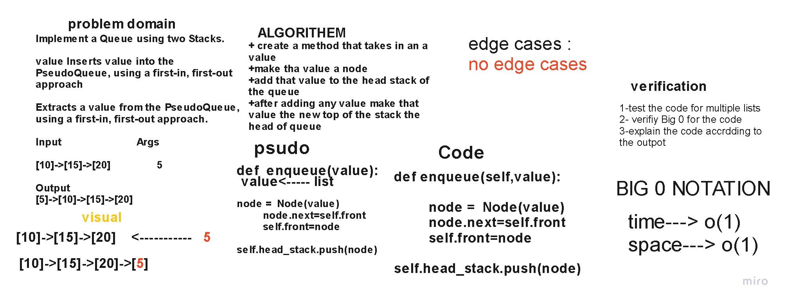
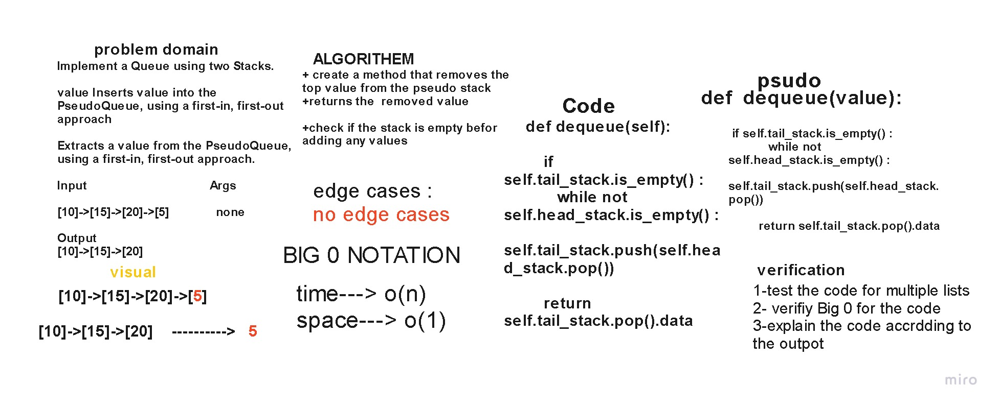

## code challenge 11

[x]Create a new class called pseudo queue.

[x]Do not use an existing Queue.

[x]Instead, this PseudoQueue class will implement our standard queue interface (the two methods listed below),

[x]Internally, utilize 2 Stack instances to create and manage the queue

## Methods:
[x]enqueue Arguments: value Inserts value into the PseudoQueue, using a first-in, first-out approach.

enqueue(value)
Input	                       Args	                                              Output
[10]->[15]->[20]            	5	                                        [5]->[10]->[15]->[20]

[x] dequeue Arguments: none Extracts a value from the PseudoQueue, using a first-in, first-out approach.

Input	                           Output	                  Internal State
[5]->[10]->[15]->[20]	             20	                      [5]->[10]->[15])

 
## Approach & Efficiency
<!-- What approach did you take? Why? What is the Big O space/time for this approach? -->

enquque

dequeue

dequeue
## API
<!-- Description of each method publicly available to your Stack and Queue-->

1-  Keep 2 stacks, let's call them head and tail you will be
     able to push to the head stack and pop from the tail stack

2-  Enqueue:
           Push the new element onto head stac

3-   Dequeue:
          If tail_stack is empty, refill it by 
          popping each element from head stack and pushing it onto tail stack
          Pop and return the top element from tailstack
           Using this method, each element will be in each stack exactly once - meaning 
           each element will be pushed twice and popped twice, giving amortized constant time operations.

