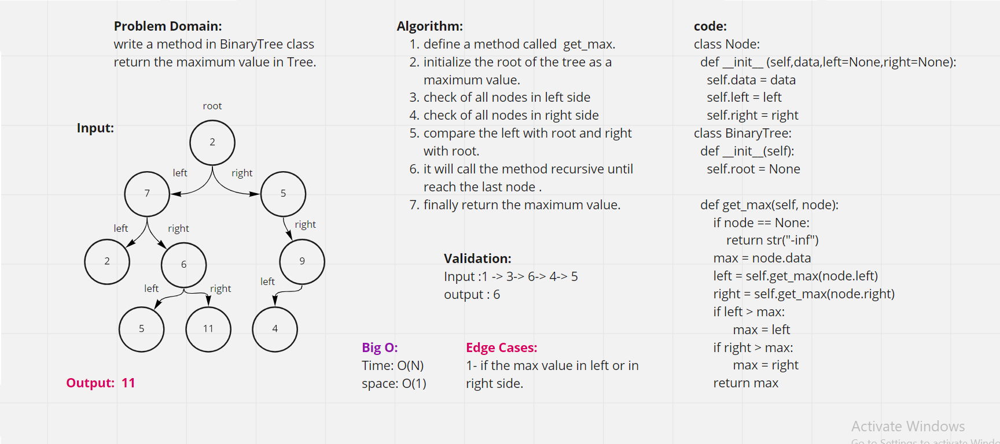

# Trees
<!-- Short summary or background information -->
A tree whose elements have at most 2 children is called a binary tree. Since each element in a binary tree can have only 2 children, we typically name them the left and right child.

## Challenge
<!-- Description of the challenge -->
* Create a Binary Tree class
* Define a method for each of the depth first traversals:
* pre order
* in order
* post order which returns an array of the values, ordered appropriately.
* Create a Node class that has properties for the value stored in the node, the left child node, and the right child node.
* Create a Binary Search Tree class with add and contains methods.

## Approach & Efficiency
<!-- What approach did you take? Why? What is the Big O space/time for this approach? -->
Time Complexity: O(n) where n is the number of nodes in a given binary tree.

Space Complexity: O(n) where n is the number of nodes in a given binary tree.

## API
<!-- Description of each method publicly available in each of your trees -->
Node - A Tree node is a component which may contain it’s own values, and references to other nodes
Root - The root is the node at the beginning of the tree
K - A number that specifies the maximum number of children any node may have in a k-ary tree. In a binary tree, k = 2.

* Pre-order: root >> left >> right
* In-order: left >> root >> right
* Post-order: left >> right >> root

## Challenge Summary Tree Max
<!-- Description of the challenge -->
#### write a method in BinaryTree class return the maximum value in Tree.

## Whiteboard Process Tree Max
<!-- Embedded whiteboard image -->

## Approach & Efficiency Tree Max
<!-- What approach did you take? Why? What is the Big O space/time for this approach? -->
I used recursion approach to solve this challenge .
this algorithm will put the root data as the maximum value in the beginning then will compare this value with all nodes in left and right side.

* Big O:
* Time: O(N)
* space: O(1)
