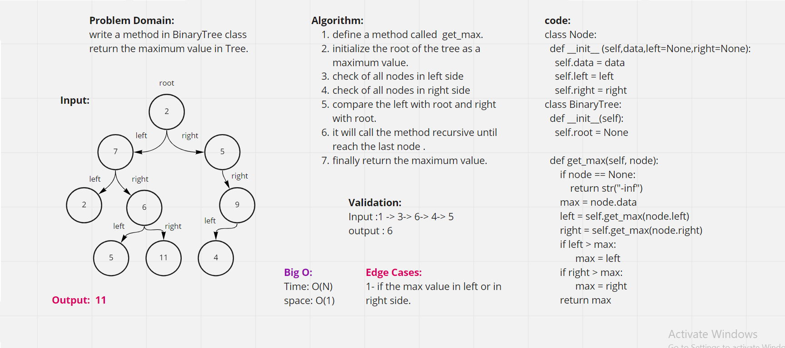

## Trees
Javascript implementation of the Trees data structure

  Create a function named fizz buzz tree using the following arguments: the k-ary tree Return to the new k-ary tree

## Challenge
Create a Binary Tree class
Define a method for each of the depth first traversals:
pre order
in order
post order which returns an array of the values, ordered appropriately.
Create a Node class that has properties for the value stored in the node, the left child node, and the right child node.
Create a Binary Search Tree class with add and contains methods.
browsing and adding in bi search trees using a recursive method

## Approach & Efficiency
approach: recursion Efficiency: space: O(h) for all methods where h is the height of the tree time: O(n) for all methods where is the number of nodes

## Whiteboard Tree Max :

